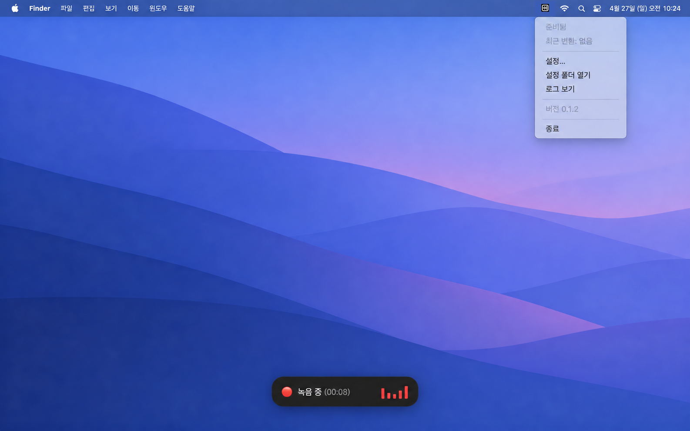
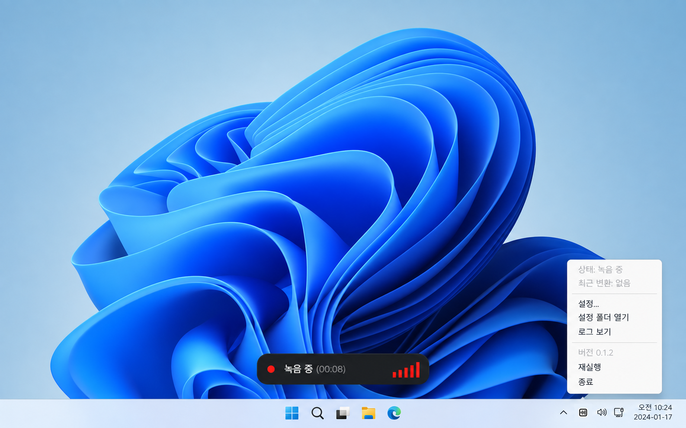
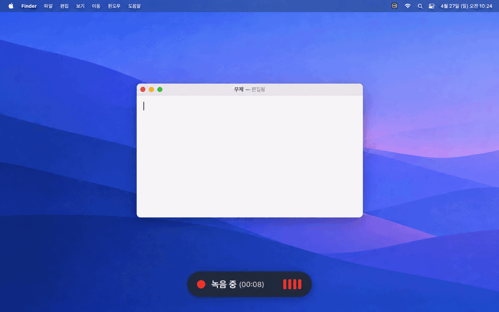
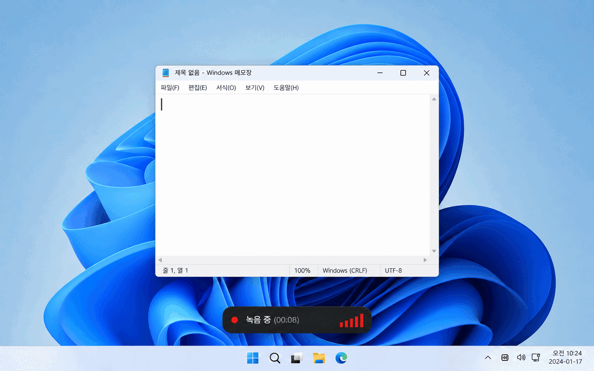

# KeyScribe

  

[English](README.md) | [한국어](README.ko.md) | [中文](README.zh-CN.md) | [日本語](README.ja.md) | [Español](README.es.md)

KeyScribeは、マイクの録音を文字起こしし、現在の入力欄へ貼り付ける音声入力アプリです。必要な機能だけをネイティブ実装し、待機時メモリは約20 MBを目標にしています。独自モデルは搭載していないため、OpenAI、ElevenLabs、またはGroqのAPIキーが必要です（Groqは無料でも利用できます）。

## 機能

- 押して話す操作、トグル録音、Escによるキャンセル、録音時間制限に対応。
- 録音・文字起こし状態とライブ入力レベルを画面下中央に表示。
- 設定でショートカット、言語、モデル、開始音量、自動Enterを変更可能。
- メニューの**ログを表示**から直近24時間の診断ログを開けます。APIキー、録音内容、文字起こし内容はログに記録されません。

## 作った理由

音声入力アプリはすでに数多くあります。複数の有料・無料アプリを試し、Redditの利用体験も参考にしました。ローカルSTTモデルはまだ精度が十分ではなく、実用上はOpenAIとElevenLabsのSTT APIが最も正確で安定していると感じました。有料アプリは機能に比べて高価だったり、機能過多で修正が頻繁だったり、待機中に100 MB以上のメモリを使ったりします。無料アプリの一部は完成度や配布品質が期待に届きませんでした。

## プレビュー

以下はコントロールメニューと利用の流れです。

### コントロールメニュー

| macOS | Windows |
| --- | --- |
|  |  |

### 利用の流れ

| macOS | Windows |
| --- | --- |
|  |  |

## インストール

ダウンロードとインストール方法は[KeyScribeダウンロードページ](https://keyscribe.gitools.net)をご覧ください。すべてのインストーラーは[GitHub Releases](https://github.com/zidell/keyscribe/releases)で直接配布しています。

| OS | ファイル | インストールまたは実行 |
| --- | --- | --- |
| macOS Apple Silicon | `KeyScribe-macos-arm64-*.dmg` | DMGを開き、アプリをApplicationsへコピー |
| macOS Intel | `KeyScribe-macos-x64-*.dmg` | DMGを開き、アプリをApplicationsへコピー |
| Windows 10/11 x64 | `KeyScribe-windows-x64-*.msix` | GitHub ReleasesからSignPath署名済みインストーラーをダウンロード |

## 最初の使用

1. メニューバーまたはトレイのKeyScribeアイコンから**設定...**を開き、ElevenLabs、OpenAI、またはGroqのAPIキーとモデルを選びます。Groqの既定モデルは`whisper-large-v3-turbo`です。
2. macOSではマイクと**システム設定 → プライバシーとセキュリティ → アクセシビリティ**を許可します。Windowsでは**設定 → プライバシーとセキュリティ → マイク**でデスクトップアプリのマイクアクセスを許可します。
3. 入力したい欄にカーソルを置き、右Command（macOS）または右Alt（Windows）を押したまま話します。キーを離すと文字起こし結果が貼り付けられます。

設定では、ショートカット、録音停止方法、録音時間（10・20・30・60分、既定30分）、認識言語、開始音量、自動送信を変更できます。自動送信を有効にすると、貼り付け後にEnterも押されます。管理者として実行されているWindowsアプリへ自動入力するには、KeyScribeも同じ権限で実行する必要がある場合があります。

## STTプロバイダー

APIキーの接頭辞からプロバイダーを自動選択し、プロバイダーごとに最後に選んだモデルを保存します。

| プロバイダー | APIキー接頭辞 | 既定モデル |
| --- | --- | --- |
| OpenAI | `sk-` | `gpt-transcribe` |
| ElevenLabs | `sk_` | `scribe_v2` |
| Groq | `gsk_` | `whisper-large-v3-turbo` |

GroqはOpenAI互換の文字起こしAPIを使います。設定の**Groqキー ↗**からAPIキーを作成し入力すると、モデル一覧を読み込めます。

### APIキーの取得

以下の手順で作成したキーをKeyScribeの**設定... → APIキー**に貼り付け、**更新**を押してください。キーはパスワードと同様に扱い、共有や公開はしないでください。

ChatGPTのサブスクリプションはOpenAI API料金とは別です。ElevenLabsで個人APIキーを作るにはFull Seatが必要です。Groqは無料で始めやすい一方、無料枠には使用量とレートの制限があります。

#### OpenAI

1. [OpenAI APIキーのページ](https://platform.openai.com/api-keys)でログインまたは登録します。
2. API Platformの**Billing**でAPIの支払い方法またはクレジットを設定します。ChatGPT Plus・ProだけではAPI利用料は含まれません。
3. 使用するプロジェクトを選択します。個人利用なら既定のプロジェクトのままで構いません。
4. **Create new secret key**を押し、名前を付けてキーを作成します。
5. 表示された`sk-…`キーをKeyScribeにコピーします。

OpenAI APIキーはプロジェクト単位で作成され、権限と利用上限はプロジェクト設定で管理できます。[OpenAI公式ガイド](https://help.openai.com/en/articles/9186755)

#### ElevenLabs

1. [ElevenLabs APIキーのページ](https://elevenlabs.io/app/developers/api-keys)でログインまたは登録します。
2. 個人APIキーの作成に必要な**Full Seat**を持っていることを確認します。なければ適切なプランまたはワークスペース管理者の設定が必要です。
3. 個人APIキー一覧で新しいキーを作成し、分かりやすい名前を付けます。
4. 作成された`sk_…`キーをKeyScribeにコピーします。

個人キーは個人APIキー設定で作成・更新できます。[ElevenLabs公式ガイド](https://elevenlabs.io/docs/overview/administration/workspaces/api-keys)

#### Groq

1. [Groq Console APIキーのページ](https://console.groq.com/keys)でログインまたは登録します。無料枠でもキーを作成できます。
2. 初回はプロジェクト選択からプロジェクトを作成するか、既定プロジェクトを選びます。
3. **Create API Key**を押し、名前を付けてキーを作成します。
4. 作成された`gsk_…`キーをKeyScribeにコピーします。

Groqキーは選択したプロジェクトに属し、無料枠にはリクエストと音声処理の上限があります。上限を増やす有料Developer tierへの移行には支払い方法が必要です。[Groqプロジェクトガイド](https://console.groq.com/docs/projects)、[料金ガイド](https://console.groq.com/docs/billing-faqs)

## トラブルシューティング

アプリの状態とエラーはメニューバーまたはトレイメニューで確認できます。**ログを表示**で診断ログを開きます。

- macOS: `~/Library/Application Support/keyscribe/debug.log`
- Windows: `%APPDATA%\keyscribe\debug.log`
- 開発実行: `dist-native/macos-debug.log`、`dist-native/windows-debug.log`

macOSログインアプリとソース監視ビルドのログは`dist-native/app.log`、`dist-native/watch.log`に保存されます。[プライバシー通知](docs/privacy.md)では音声送信とAPIキー保存について説明しています。ソースコードは[MITライセンス](LICENSE)で公開しています。
