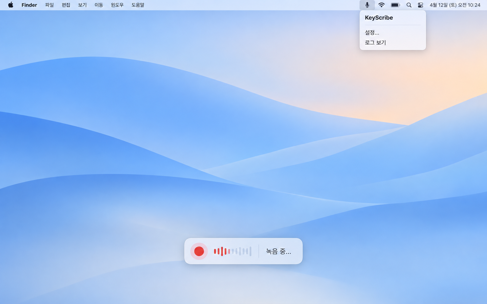
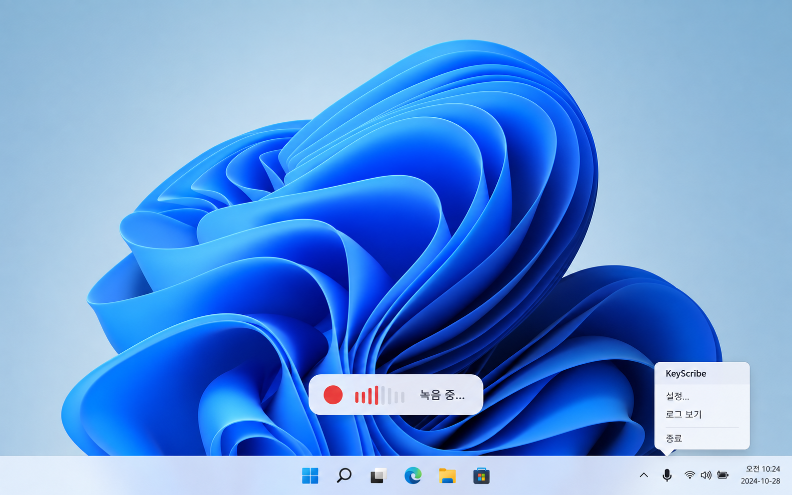

# KeyScribe

KeyScribe는 macOS 메뉴 막대와 Windows 트레이에서 실행되는 음성 받아쓰기 앱입니다. 단축키를 누르고 말하면 음성을 텍스트로 변환해 현재 입력창에 붙여넣습니다. 기본값은 키를 누르는 동안 녹음하는 방식이며, 설정에서 다시 누를 때 종료하는 방식으로 바꿀 수 있습니다.

## 특징

- OpenAI 또는 ElevenLabs 음성 인식 API를 선택할 수 있습니다.
- 누르고 말하기와 토글 녹음, Esc 취소, 녹음 시간 제한을 지원합니다.
- 녹음과 변환 상태, 실시간 입력 음량을 화면 중앙 하단에 표시합니다.
- 설정에서 단축키, 언어, 모델, 효과음 음량, 자동 Enter 입력을 바꿀 수 있습니다.
- 설정 창의 **로그 보기**에서 최근 24시간의 진단 로그를 열 수 있습니다. API 키와 녹음·변환 내용은 로그에 남기지 않습니다.

## 화면 미리보기

아래 이미지는 앱 사용 흐름을 보여 주는 소개용 UI 이미지입니다.

| macOS | Windows |
| --- | --- |
|  |  |

## 설치

[다운로드 페이지](https://keyscribe.gitools.net)에서 운영체제에 맞는 파일을 받습니다. 최신 `main`의 macOS 설치용 DMG는 [GitHub Releases](https://github.com/zidell/keyscribe/releases)의 사전 릴리스에서도 받을 수 있습니다. Windows Store 배포는 첫 등록과 심사가 완료된 뒤 제공됩니다.

| 운영체제 | 파일 | 설치 또는 실행 |
| --- | --- | --- |
| macOS Apple Silicon | `KeyScribe-macos-arm64-*.dmg` | DMG를 열고 앱을 Applications로 복사 |
| macOS Intel | `KeyScribe-macos-x64-*.dmg` | DMG를 열고 앱을 Applications로 복사 |
| Windows 10/11 x64 | Microsoft Store | 첫 등록·심사 완료 후 Store에서 설치 |

## 처음 사용할 때

1. 메뉴 막대 또는 트레이의 KeyScribe 아이콘에서 **설정...**을 열고 ElevenLabs 또는 OpenAI API 키와 모델을 선택합니다.
2. macOS에서는 마이크와 **시스템 설정 → 개인 정보 보호 및 보안 → 손쉬운 사용** 권한을 허용합니다. Windows에서는 **설정 → 개인 정보 및 보안 → 마이크**에서 데스크톱 앱의 마이크 접근을 허용합니다.
3. 텍스트를 입력할 창에 커서를 놓고 오른쪽 Command(macOS) 또는 오른쪽 Alt(Windows)를 누른 채 말합니다. 키를 놓으면 전사 결과가 붙여넣어집니다.

설정에서 단축키, 녹음 종료 방식, 녹음 시간 제한(10·20·30·60분, 기본 30분), 인식 언어, 녹음 시작 효과음 음량, 자동 전송 여부를 바꿀 수 있습니다. 자동 전송을 켜면 붙여넣은 뒤 Enter도 누릅니다. 관리자 권한으로 실행한 Windows 앱에 자동 입력하려면 KeyScribe도 같은 권한으로 실행해야 할 수 있습니다.

## 문제 확인

앱의 상태와 오류는 메뉴 막대 또는 트레이 메뉴에서 확인할 수 있습니다. 설정 창의 **로그 보기**는 앱 진단 로그를 엽니다.

- macOS: `~/Library/Application Support/keyscribe/debug.log`
- Windows: `%APPDATA%\keyscribe\debug.log`
- 개발 실행: `dist-native/macos-debug.log`, `dist-native/windows-debug.log`

macOS 로그인 앱과 소스 감시 빌드 로그는 `dist-native/app.log`, `dist-native/watch.log`에 저장됩니다.

음성 전송과 API 키 저장 방식은 [개인정보 안내](docs/privacy.md)에 설명되어 있습니다.

소스 코드는 [MIT 라이선스](LICENSE)로 공개합니다.
