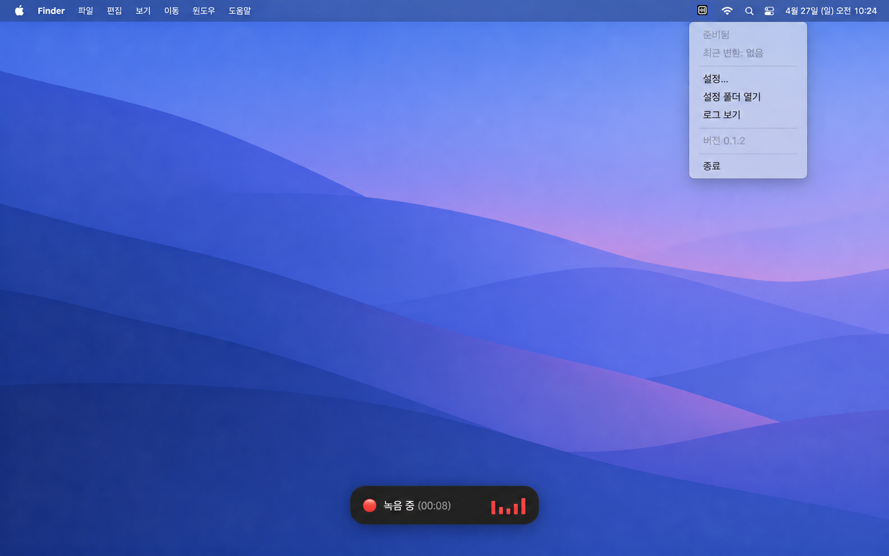
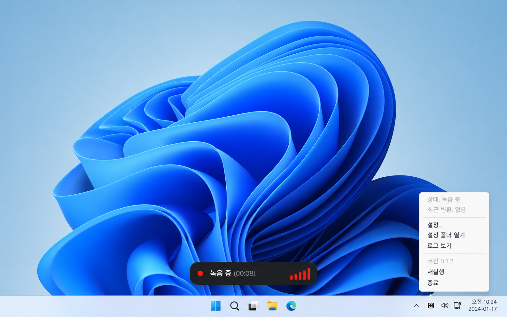
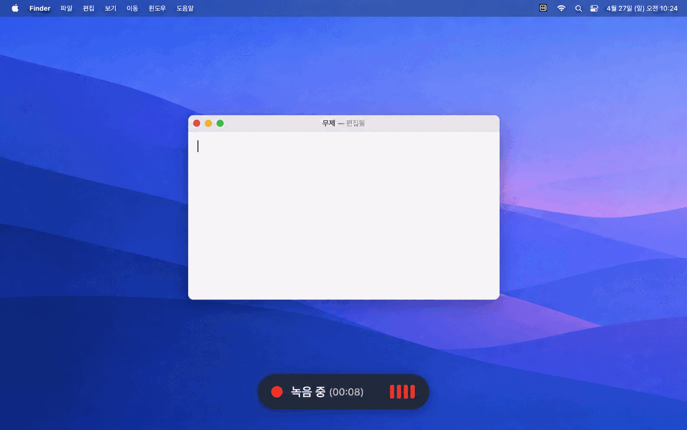
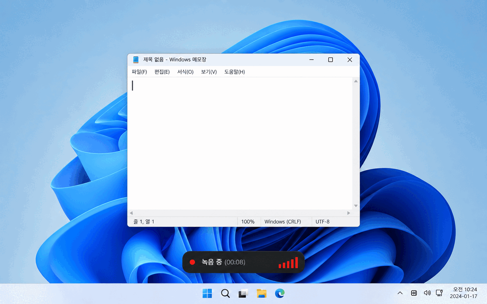

# KeyScribe

  

[English](README.md) | [한국어](README.ko.md) | [中文](README.zh-CN.md) | [日本語](README.ja.md) | [Español](README.es.md)

> 这是个人开发并免费公开的应用。欢迎自由使用，但不接受功能建议、错误报告或使用支持请求。如需其他功能，请依据 MIT 许可证 fork 后自行修改。

KeyScribe 是一款语音输入应用：它将麦克风录音转写为文字，并粘贴到当前输入框。应用以原生方式实现，只保留必要功能，目标是在空闲时使用约 20 MB 内存。它不包含自有模型，因此需要 OpenAI、ElevenLabs 或 Groq API 密钥（Groq 可免费使用）。

## 功能

- 一个按键两种用法：短按后松开会一直录音，直到再次按下；按住超过 1 秒，松开时即结束录音。支持 Esc 取消和录音时间限制。
- 以小部件显示录音和转写状态及实时输入音量，默认位于屏幕底部中央，也可以设为**不显示**。
- 即使关闭小部件，菜单栏（托盘）图标也会在录音时变红、转写时变橙。
- 可在设置中更改快捷键、语言、模型、提示音音量、录音小部件位置和自动按 Enter。
- **识别词**可提升专有名词的准确率；**替换词**（`查找 => 替换`）在粘贴前修正始终听错的词。在替换内容中写 `[enter]`、`[cmd+k]`，就会在该位置真正按下这个键。
- 为避免因网络或 API 错误导致转写失败时丢失录音，原始录音（WAV）会被保留。保留期限可在设置中选择 1 小时、1 天、7 天或 30 天（默认 7 天），过期的日志和录音会自动删除。可通过菜单中的**日志和原始录音文件夹**与诊断日志一起打开；API 密钥和转写内容不会写入日志。
- 如果焦点被切走，导致结果丢失或粘贴到了别处，可点击菜单顶部的**再次粘贴**，把最后一次结果粘贴到当前光标所在位置。结果只保存在内存中直到退出应用，且不会再次自动按 Enter。

## 为什么制作它

市面上已有很多语音输入应用。我试用了多款付费和免费产品，也参考了 Reddit 的使用体验。当地 STT 模型的准确性仍不够理想；在日常使用中，OpenAI 与 ElevenLabs 的 STT API 是最准确、稳定的选择。付费应用往往价格偏高、功能膨胀导致更新频繁，或在空闲时使用超过 100 MB 内存；部分免费应用的完成度或发布质量也不符合预期。

## 预览

下图展示应用的控制菜单和使用流程。

### 控制菜单

| macOS | Windows |
| --- | --- |
|  |  |

### 使用流程

| macOS | Windows |
| --- | --- |
|  |  |

## 安装

请在 [KeyScribe 下载页面](https://keyscribe.gitools.net)查看下载和安装说明。macOS 和 Ubuntu 安装文件通过 [GitHub Releases](https://github.com/zidell/keyscribe/releases) 发布，Windows 应用通过 Microsoft Store 分发。有新版本时，macOS 应用会提示并在确认后安装，Microsoft Store 会自动更新 Windows 应用，Ubuntu 应用会在托盘菜单中显示下载项。

| 操作系统 | 文件 | 安装或运行 |
| --- | --- | --- |
| macOS Apple Silicon | `KeyScribe-macos-arm64-*.dmg` | 打开 DMG 并将应用复制到 Applications |
| macOS Intel | `KeyScribe-macos-x64-*.dmg` | 打开 DMG 并将应用复制到 Applications |
| Windows 10/11 x64 | Microsoft Store | 即将上架 Microsoft Store |
| Ubuntu 24.04+ amd64 | `KeyScribe-ubuntu-amd64-*.deb` | [Ubuntu 原生版安装](native/linux/README.md) |

## 首次使用

1. 从菜单栏或托盘的 KeyScribe 图标打开**设置...**，选择 ElevenLabs、OpenAI 或 Groq API 密钥和模型。Groq 默认模型为 `whisper-large-v3-turbo`。
2. macOS 请允许麦克风及**系统设置 → 隐私与安全性 → 辅助功能**权限。Windows 请在**设置 → 隐私和安全性 → 麦克风**中允许桌面应用访问麦克风。Ubuntu 请在设置的“快捷键 / 权限”标签页中，按系统对话框提示注册全局快捷键并允许键盘控制（自动粘贴）。
3. 将光标放到需要输入文字的位置，按住右 Command（macOS）、右 Alt（Windows）或 Ctrl+Alt+Space（Ubuntu）说话。松开按键即可粘贴转写结果。

可在设置中更改快捷键、录音停止方式、录音时限（10、20、30、60 分钟；默认 30 分钟）、识别语言、录音开始提示音音量和自动发送。启用自动发送后，粘贴完成会按 Enter。若要向以管理员身份运行的 Windows 应用自动输入，KeyScribe 也可能需要以管理员身份运行。

## Ubuntu 支持

除 macOS 和 Windows 应用外，KeyScribe 还提供用 C/GTK 编译的 Ubuntu 原生应用。
可从[最新 Ubuntu 版本](https://github.com/zidell/keyscribe/releases?q=linux-v&expanded=true)下载 `.deb` 安装文件，构建、安装和使用说明见
[Ubuntu 指南](native/linux/README.md)。支持 PipeWire/PulseAudio 录音和三种转写服务，
在 GNOME 和 KDE Plasma 上通过桌面门户使用全局快捷键和自动粘贴。在缺少所需门户的桌面上，
请用应用中的录音按钮录音，再复制结果粘贴。

## STT 提供商

应用会根据 API 密钥前缀自动选择提供商，并分别保存每个提供商最后选择的模型。

| 提供商 | API 密钥前缀 | 默认模型 |
| --- | --- | --- |
| OpenAI | `sk-` | `gpt-transcribe` |
| ElevenLabs | `sk_` | `scribe_v2` |
| Groq | `gsk_` | `whisper-large-v3-turbo` |

Groq 使用兼容 OpenAI 的转写 API。可通过设置中的 **Groq 密钥 ↗** 创建 API 密钥；输入后即可载入模型列表。

### 获取 API 密钥

将按以下步骤创建的密钥粘贴到 KeyScribe 的**设置... → API 密钥**，然后点按**刷新**。密钥和密码一样重要，请勿分享或公开发布。

ChatGPT 订阅与 OpenAI API 计费相互独立；ElevenLabs 创建个人 API 密钥需要 Full Seat。Groq 最易免费开始使用，但免费层有用量和速率限制。

#### OpenAI

1. 登录或注册 [OpenAI API 密钥页面](https://platform.openai.com/api-keys)。
2. 在 API Platform 的 **Billing** 中设置 API 付款方式或额度；ChatGPT Plus 或 Pro 不含 API 用量。
3. 选择项目（个人用户可使用默认项目）。
4. 点击 **Create new secret key**，命名后创建密钥。
5. 将显示的 `sk-…` 密钥复制到 KeyScribe。

OpenAI API 密钥按项目创建，可在项目设置中管理权限和用量限制。[OpenAI 官方说明](https://help.openai.com/en/articles/9186755)

#### ElevenLabs

1. 登录或注册 [ElevenLabs API 密钥页面](https://elevenlabs.io/app/developers/api-keys)。
2. 确认拥有创建个人 API 密钥所需的 **Full Seat**；否则需相应套餐或工作区管理员设置。
3. 在个人 API 密钥列表中新建密钥并命名。
4. 将生成的 `sk_…` 密钥复制到 KeyScribe。

个人密钥可在个人 API 密钥设置中创建和轮换。[ElevenLabs 官方说明](https://elevenlabs.io/docs/overview/administration/workspaces/api-keys)

#### Groq

1. 登录或注册 [Groq Console API 密钥页面](https://console.groq.com/keys)；免费层也可创建密钥。
2. 首次使用时，在项目选择器中新建或选择默认项目。
3. 点击 **Create API Key**，命名后创建密钥。
4. 将生成的 `gsk_…` 密钥复制到 KeyScribe。

Groq 密钥归属于所选项目，免费层有请求和音频处理限制。提高额度的付费 Developer 层需要付款方式。[Groq 项目说明](https://console.groq.com/docs/projects)，[计费说明](https://console.groq.com/docs/billing-faqs)

## 故障排除

可在菜单栏或托盘菜单查看应用状态和错误；**日志和原始录音文件夹**会打开存放诊断日志（`debug.log`）和原始录音（`recording-*.wav`）的文件夹。

- macOS：`~/Library/Application Support/keyscribe/logs/`
- Windows：`%APPDATA%\keyscribe\logs\`
- Ubuntu：`~/.local/share/keyscribe/logs/`（或 `$XDG_DATA_HOME/keyscribe/logs/`）
- 开发运行：`dist-native/logs/`

[隐私说明](docs/privacy.md)介绍音频传输和 API 密钥存储方式。源代码采用 [MIT 许可证](LICENSE)发布。
